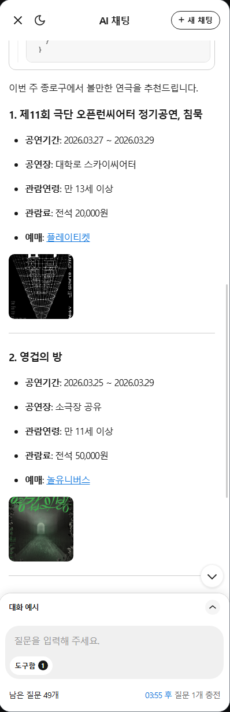
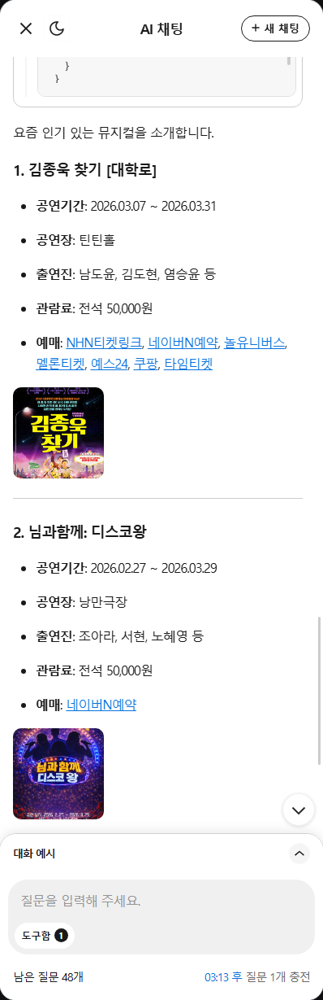
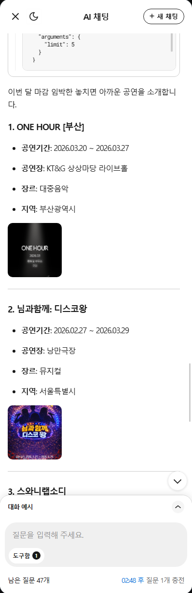

<div align="center">
  <h1>art-bridge</h1>
  <a href="https://art-bridge.onrender.com/mcp">MCP Endpoint: https://art-bridge.onrender.com/mcp</a>
</div>

<br />

> KOPIS 기반 공연 추천 MCP 서버 — 자연어 한 문장으로 실시간 공연 정보 조회

## Background

공연 정보를 찾으려면 KOPIS, 각 극장 사이트, 포털을 따로 확인해야 합니다.
AI에게 물어봐도 학습 데이터 기준이라 현재 공연 중인 실시간 정보는 얻기 어렵습니다.

카카오 MCP Player 10 공모전을 계기로 KOPIS API를 MCP 서버로 연결해, PlayMCP·Claude·ChatGPT 등 AI에서 실시간으로 공연을 조회하고 추천할 수 있도록 만들었습니다. "이번 주에 연극이나 볼래?"처럼 불완전한 자연어에서 날짜·장르·위치 파라미터의 우선순위를 자동으로 추론하는 것이 설계의 핵심입니다.

## Features

- 지역·날짜·장르 기반 공연 검색 — 조건에 맞는 결과가 없으면 4단계로 자동 확장
- 박스오피스 인기 공연 추천 — 오픈런·마감임박 가중치 반영
- 무료 공연 필터링 — 오늘부터 30일 이내 무료 우선, 부족하면 저렴한 순으로 보충
- 공연 상세 조회 — 캐스팅, 시놉시스, 관람료, 예매 링크 통합

#### get_genre_list

사용 가능한 장르 코드 목록을 반환합니다. 다른 도구 호출 전에 먼저 확인하세요.

파라미터 없음

#### search_events_by_location

장르, 날짜, 지역으로 공연을 검색합니다. 결과가 부족하면 4단계 완화 전략이 자동으로 동작합니다.

| 파라미터 | 타입 | 필수 | 설명 |
|---|---|---|---|
| `genreCode` | string | ✅ | 장르 코드 |
| `startDate` | string | ✅ | 시작일 (YYYYMMDD) |
| `endDate` | string | ✅ | 종료일 (YYYYMMDD) |
| `sidoCode` | string | | 시/도 코드 |
| `gugunCode` | string | | 구/군 코드 |
| `limit` | number | | 최소 결과 개수 (기본 3, 최대 50) |

#### filter_free_events

오늘부터 30일 이내 무료·저렴한 공연을 검색합니다. 날짜는 항상 오늘~30일로 고정됩니다.

| 파라미터 | 타입 | 필수 | 설명 |
|---|---|---|---|
| `genreCode` | string | ✅ | 장르 코드 |
| `sidoCode` | string | | 시/도 코드 |
| `limit` | number | | 결과 개수 (기본 20, 최대 50) |

#### get_trending_performances

KOPIS 박스오피스 기반으로 인기 공연을 추천합니다. 해당 장르에 결과가 없으면 전체 장르로 자동 확장합니다.

| 파라미터 | 타입 | 필수 | 설명 |
|---|---|---|---|
| `genreCode` | string | | 장르 코드 (생략 시 전체) |
| `limit` | number | | 결과 개수 (기본 20, 최대 50) |

#### get_event_detail

공연 ID로 상세 정보를 조회합니다. 시놉시스, 출연진, 관람료, 공연 시간, 연령 제한, 예매 링크를 포함합니다.

| 파라미터 | 타입 | 필수 | 설명 |
|---|---|---|---|
| `eventId` | string | ✅ | 공연 ID (mt20id) |

## Preview

| \<"종로구에서 이번 주 볼만한 연극 추천해주고 예매 링크도 알려줘" 응답 화면\> | \<"요즘 뮤지컬 뭐가 제일 핫해? 출연진이랑 예매 링크도 알려줘" 응답 화면\> |
|---|---|
|  |  |

| \<"이번 달 마감 임박한 공연 중에 놓치면 아까운 거 뭐야?" 응답 화면\> | |
|---|---|
|  | |

## Tech Stack

**Backend**

[](https://skillicons.dev)

**Infra**

[](https://skillicons.dev)

## Getting Started

**Requirements**
- Node.js 20+
- KOPIS API 키 ([공연예술통합전산망 open API](https://www.kopis.or.kr/por/cs/openapi/openApiUseSend.do) 에서 발급)

**macOS / Linux**
```bash
git clone https://github.com/htjworld/art-bridge.git
cd art-bridge
npm install
cp .env.example .env  # KOPIS_API_KEY 입력
npm run build
npm start
```

**Windows**
```bash
git clone https://github.com/htjworld/art-bridge.git
cd art-bridge
npm install
copy .env.example .env
npm run build
npm start
```

서버가 실행되면 아래 엔드포인트가 활성화됩니다.

```
POST http://localhost:3000/mcp    ← MCP 엔드포인트
GET  http://localhost:3000/health ← 상태 확인
```

## License

MIT © htjworld
